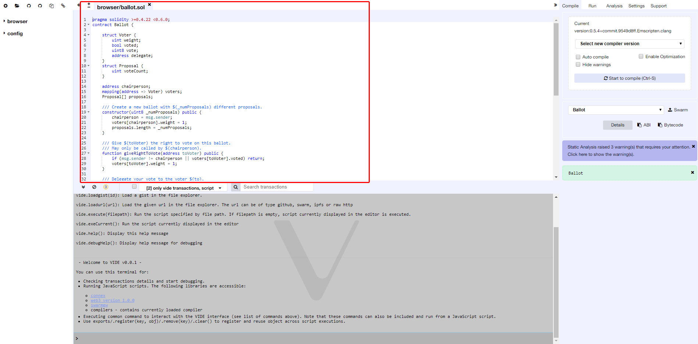

# VIDE (VeChain-IDE)

VIDE is a browser-based compiler and IDE that enables users to build **VeChainThor contracts with Solidity language** and to debug transactions.

To try it out, visit [https://vechainstore.com/ide](https://vechainstore.com/ide).




## INSTALLATION:

Install **npm** and **node.js** (see https://docs.npmjs.com/getting-started/installing-node), then do:

Clone the github repository (`wget` need to be installed first) :

```bash
git clone https://github.com/mobileteamdev/vide-web.git
cd vide-web
npm install
npm run build
```


## Documentation

To see details about how to use VIDE for developing and/or debugging Solidity contracts, please see [our documentation page](https://vide.readthedocs.io)
