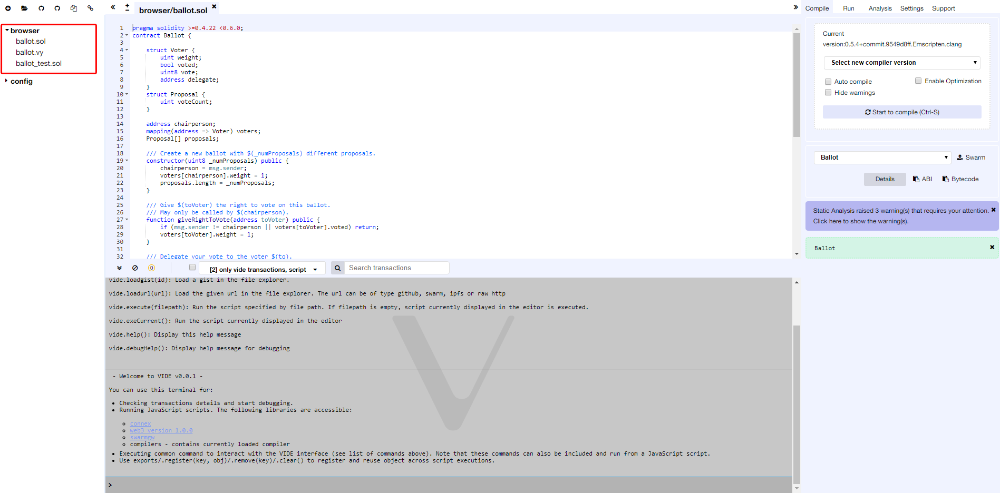
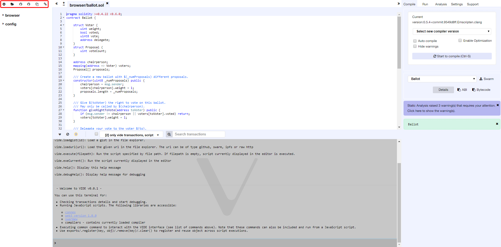

File Explorer
=============

The file explorer lists by default all the files stored in your browser.
You can see them in the browser folder. You can always rename, remove or
add new files to the file explorer.

Note that clearing the browser storage will permanently delete all the
solidity files you wrote.

We will start by reviewing at the icons at the top left - from left to
the right:

Create new File
---------------

Creates a new `untitled.sol` file in VIDE.

Add Local File
--------------

Allows you to select files from the local file system and import them to
the VIDE browser storage.

Publish to Gist
---------------

Publishes all files from the browser folder to a gist.
Gist API has changed in 2018 and it unfortunately requires users to be authenticated to be able to publish a gist.

Click [this link](https://github.com/settings/tokens) to Github tokens setup  and select Generate new token.
Then check only Create gists checkbox and generate a new token.

Then paste it in VIDE (right panel/Settings tab) and click Save. Now you should be able to use the feature.

Copy to another VIDE instance
------------------------

Enables you to copy files from the browser storage to another instance
(URL) of VIDE.