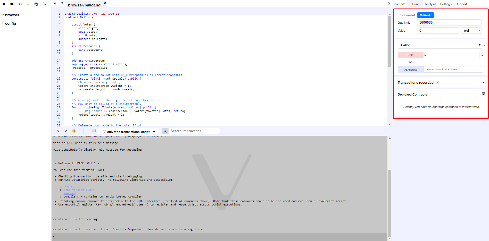
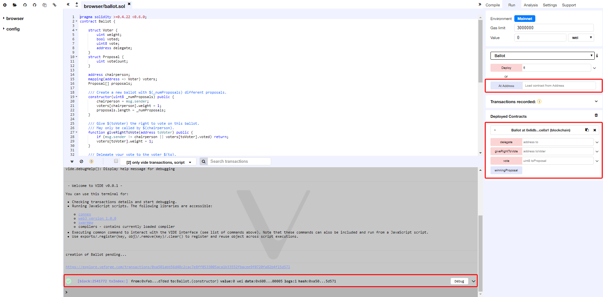
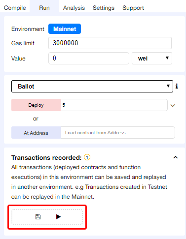

Running transactions
====================

The Run tab is an important section of VIDE. It allows you to send
transactions to the current environment.



Run Setup
---------

The following settings allow you to directly influence the transaction
execution:

Environment:

-   `Mainnet` or `Testnet`: VIDE will connect to an injected
    Connex provider. `Sync` and `Comet` are example of
    providers that inject Connex, thus can be used with this
    option.

-   Gas Limit: the maximum amount of gas that can be set for all the
     transactions created in VIDE.

-   Value: the amount of value for the next created transaction (this
     value is always reset to 0 after each transaction execution).

 

Initiate Instance
-----------------

This section contains the list of compiled contracts and 2 actions:

-   `At Address` assumes the given address is an instance of the
    selected contract. It is then possible to interact with an already
    deployed contract. There's no check at this point, so be careful
    when using this feature, and be sure you trust the contract at that
    address.

-   `Create` send a transaction that deploys the selected contract. When
    the transaction is mined, the newly created instance will be added
    (this might take several seconds). Note that if the `constructor`
    has parameters, you need to specify them.

Pending Instances
-----------------

Validating a transaction take several seconds. During this time, the GUI
shows it in a pending mode. When transaction is mined the number of
pending transactions is updated and the transaction is added to the log
(see ../terminal)

Using the ABI
------------

Using `Deploy` or `At Address` is a classic use case of VIDE. It is
possible though to interact with a contract by using its ABI. The ABI is
a JSON array which describe its interface.

To interact with a contract using the ABI, create a new file in VIDE
with extension `*.abi` and copy the ABI content to it. Then in the input
next to `At Address`, put the Address of the contract you want to
interact with. Click on `At Address`, a new "connection" with the
contract will popup below.

Using the Recorder
------------------

The Recorder allows to save a bunch of transactions in a JSON file and
rerun them later either in the same environment or in another.

Saving to JSON allows to easily check the transaction list, tweak input
parameters, change linked library, etc...

We can find many use cases for the recorder, for instance:
:   -   After having coded and tested contracts in a constrained
        environment (like the Testnet), it could be interesting to
        redeploy them easily in a more persisted environment (like a
        Mainnet) in order to check whether everything behaves normally
        in a classic environment.
    -   Deploying contract does often require more than creating one
        transaction.
    -   Working in a dev environment does often require to setup the
        state in a first place.



Saving a record ends up with the creation of this type of content (see
below):

In that specific record, 3 transactions are executed:

The first corresponds to the deployment of the lib `testLib`.

The second corresponds to the deployment of the contract `test`, the
first parameter of the constructor is set to 11. That contract depends
on a library. The linkage is done using the property `linkReferences`.
In that case we use the addres of the previously created library :
`created{1512830014773}`. the number is the id (timestamp) of the
transaction that leads to the creation of the library.

The third parameter corresponds to the call to the function `set` of the
contract `test` (the property to is set to: `created{1512830015080}`) .
Input parameters are `1` and
`0xca35b7d915458ef540ade6068dfe2f44e8fa733c`

all these transactions are created using the value of the accounts
`account{0}`.

``` {.sourceCode .none}
{
"accounts": {
    "account{0}": "0xca35b7d915458ef540ade6068dfe2f44e8fa733c"
},
"linkReferences": {
    "testLib": "created{1512830014773}"
},
"transactions": [
    ...
],
"abis": {
    ...
}
}
```
