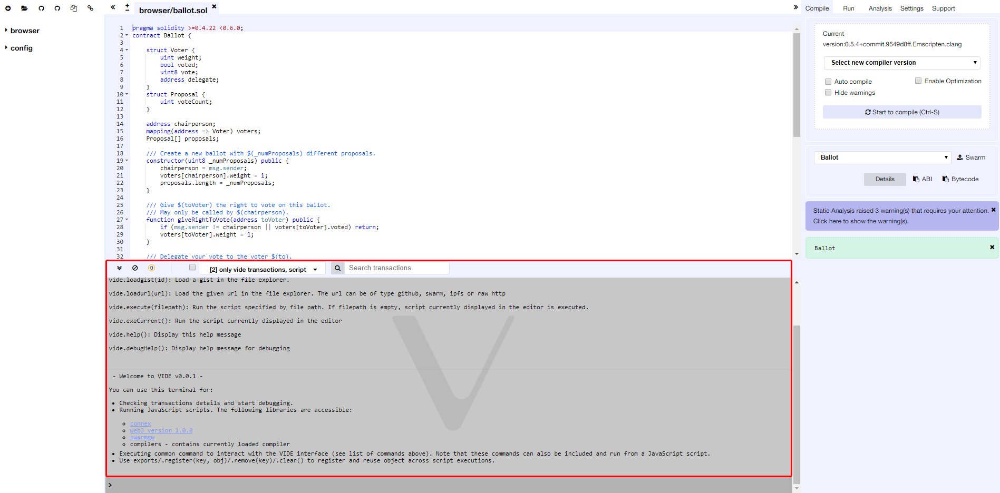

Terminal
========

Features, available in the terminal:

-   It integrates a JavaScript interpreter and the `connex` and `web3` object. It
    enables the execution of the JavaScript script which interacts with
    the current context.
-   It displays important actions made while interacting with the VIDE (i.e. sending a new transaction).
-   It displays transactions that are mined in the current context. You
    can choose to display all transactions or only transactions that
    refers to the contracts VIDE knows (e.g transaction created from
    the VIDE).
-   It allows searching for the data and clearing the logs from the
    terminal.

